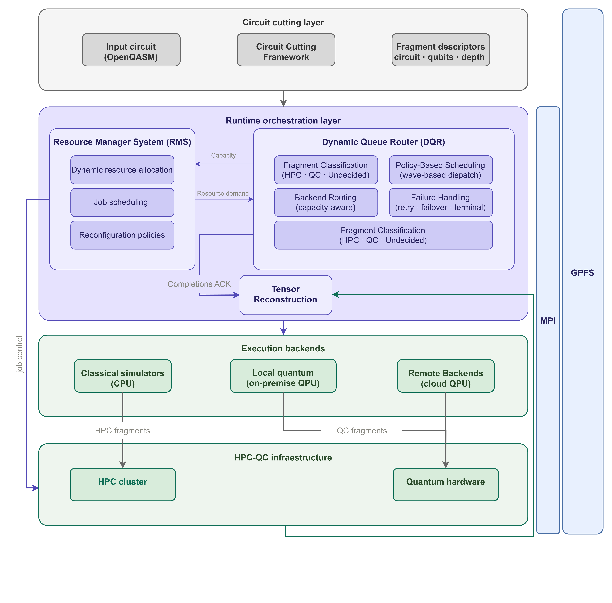
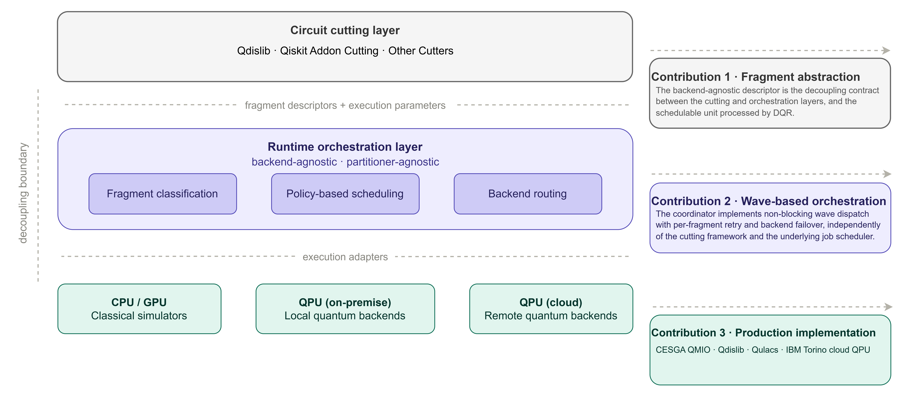
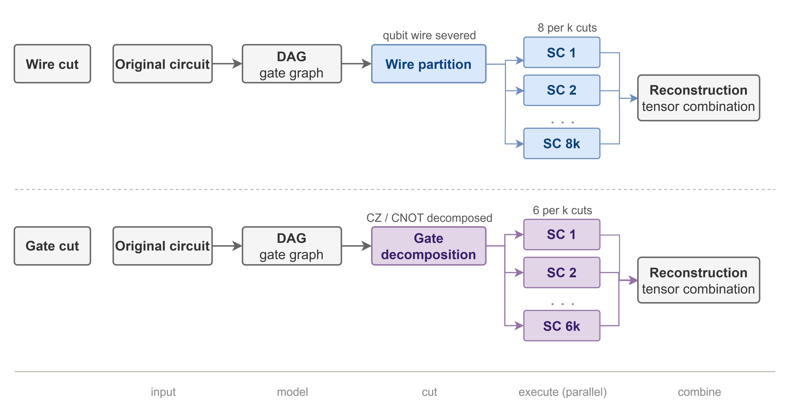
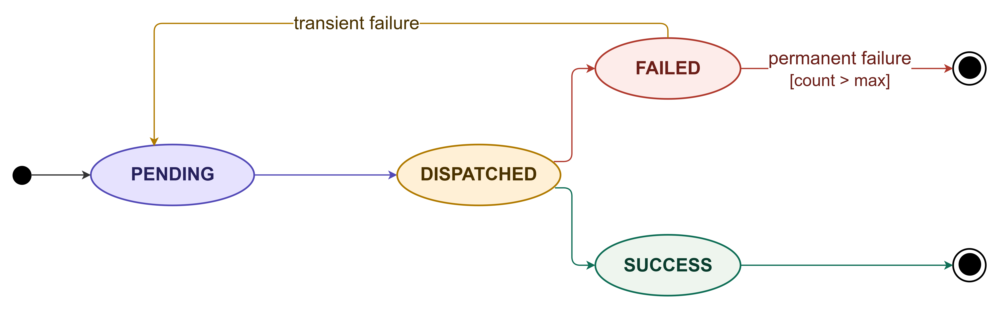

# DQR — Dynamic Queue Router

> **Wave-based dispatch of cut quantum circuits in hybrid HPC–QC systems**

DQR is a runtime framework that decouples quantum circuit cutting from HPC execution orchestration. It treats each cut fragment as an independent, backend-agnostic schedulable unit, transforming the quantum execution problem into a classical heterogeneous scheduling problem that production HPC infrastructure can address with mature scheduling and fault-tolerance techniques.

The framework is deployed on the **CESGA Qmio** quantum computing infrastructure, integrating with the **DMR** (Dynamic Management of Resources) system developed at the Barcelona Supercomputing Center (BSC).

> 📄 **Reference paper:** *Wave-Based Dispatch for Circuit Cutting in Hybrid HPC--Quantum Systems* — R. S. Raigada-García, J. Jorba, S. Iserte. Preprint submitted to *Future Generation Computer Systems*.

Hybrid High-performance Computing (HPC)—quantum workloads based on circuit cutting decompose large quantum circuits into independent fragments, but existing frameworks tightly couple cutting logic to execution orchestration, preventing HPC centers from applying mature resource management policies to Noisy Intermediate-Scale Quantum (NISQ) workloads. We present **DQR (Dynamic Queue Router**, a runtime framework that bridges this gap by treating circuit fragments as first-class schedulable units. The framework introduces a backend-agnostic fragment descriptor to expose structural properties without requiring execution layers to parse quantum code, a wave-based coordinator that achieves pipeline concurrency via non-blocking polling, and a production-ready implementation on the **CESGA Qmio supercomputer** integrating both QPUs **local on-premises (Qmio)** and **remote cloud (IBM Torino)}** backends. Experiments on a 32-qubit Hardware-Efficient Ansatz (HEA) circuit demonstrate not only makespan improvements over a monolithic CPU baseline but also **transparent per-fragment failover recovery**—specifically rerouting tasks from the local QPU to classical simulators upon encountering hardware-level incompatibilities—without pipeline restart. For deeper circuits, the coordination residual accounts for only 5% of the total execution time, highlighting the framework's scalability. These results show that DQR enables HPC centers to integrate NISQ workloads into existing production infrastructure while preserving the flexibility to adopt improved cutting algorithms or heterogeneous backend technologies.

---

## Overview

Near-term QPUs are constrained in qubit count, circuit depth, and availability. Executing scientifically meaningful quantum workloads requires:

1. Partitioning large circuits into hardware-compatible fragments via **circuit cutting**.
2. Dispatching those fragments to heterogeneous backends — classical HPC simulators and real QPUs — under explicit capacity and routing policy constraints.
3. Transparently handling QPU failures, retries, and QC→HPC failover without pipeline restart.

DQR addresses all three concerns through a layered architecture with three loosely coupled layers that communicate via GPFS (file-based fragment descriptors and results) and MPI (coordinator–worker messages):


*Figure 1 — System architecture of the DQR framework. The Circuit Cutting Layer decomposes input OpenQASM circuits and emits fragment descriptors. The Runtime Orchestration Layer (RMS + DQR) manages HPC allocation, fragment classification, wave dispatch, and failure handling. The Execution Backends layer routes fragments to CPU simulators, on-premise QPUs (CESGA Qmio), and cloud QPUs (IBM Torino).*

The core design principle is the **decoupling of cutting from orchestration**: the cutting layer produces lightweight, immutable fragment descriptor tuples exposing only structural properties (qubits, depth, gates, reconstruction coefficient, backend admissibility). The execution layer consumes these descriptors without needing to parse quantum circuit code, enabling cutting frameworks and execution backends to evolve independently.

---

## Scientific contributions

The framework makes three concrete contributions, illustrated in the architecture figure above:

**1 — Fragment abstraction.** A standardized, immutable fragment descriptor tuple that exposes structural properties (qubits, depth, gates, reconstruction coefficient, backend admissibility) without requiring execution layers to parse quantum circuit code. This is the decoupling contract between the cutting and orchestration layers, and makes each schedulable unit processable by DQR independently.

**2 — Wave-based dynamic orchestration.** A coordinator-driven dispatch algorithm that achieves pipeline concurrency via non-blocking polling, handles transient QPU failures through per-fragment retry and QC→HPC failover, and adapts dynamically to heterogeneous resource capacity. The runtime supports iteration-aware policies that prioritize scarce QPU slots while maintaining high HPC utilization.

**3 — Production implementation on CESGA Qmio.** A complete implementation of the ecosystem on the CESGA Qmio supercomputer, integrating Qdislib (BSC) for circuit cutting, Qulacs for CPU simulation, and the Qmio SDK for NISQ QPU execution on the on-premise Oxford Quantum Circuits 32-qubit superconducting processor. IBM Torino (cloud, 133 qubits) is also supported as a remote backend.


*Figure 2 — Runtime-oriented execution model. The circuit cutting layer is decoupled from the orchestration layer via fragment descriptors, enabling hardware-aware, policy-driven scheduling across heterogeneous HPC–QC backends. The three contributions (right) are positioned within the layer each one addresses.*

---

## Circuit cutting background

Circuit cutting overcomes QPU qubit/depth limits by decomposing large quantum circuits into smaller subcircuits executed independently and recombined via classical post-processing. Two strategies are supported:


*Figure 3 — Circuit cutting strategies. Wire cuts sever qubit paths (8ᵏ subcircuits); gate cuts decompose two-qubit gates into quasi-probabilistic locals (6ᵏ variants). Results are recombined via tensor reconstruction of the observable expectation value.*

Post-execution observables are reconstructed via:

$$\langle O \rangle = \sum_i c_i \langle O_i \rangle$$

where $c_i$ are quasi-probability coefficients from cuts/projections. Cutting scales hardware reach at exponential classical overhead — $\mathcal{O}(6^k)$ subcircuits for gate cuts and $\mathcal{O}(8^k)$ for wire cuts — motivating the need for efficient orchestration that DQR provides.

---

## Fragment lifecycle

Each fragment $f_i$ is represented as an immutable tuple $f_i = (SC_i,\, q_i,\, d_i,\, g_i,\, c_i,\, B_i)$ where $SC_i$ is the subcircuit payload (OpenQASM + metadata), $q_i$ the qubit count, $d_i$ the circuit depth, $g_i$ the two-qubit gate count, $c_i$ the quasi-probability reconstruction coefficient, and $B_i \subseteq \{\text{HPC, QC}\}$ the set of admissible backends.

Execution proceeds in discrete **dispatch waves** via the fragment state machine:


*Figure 4 — DQR Fragment lifecycle state machine. A fragment is created PENDING and transitions to DISPATCHED upon assignment. A transient failure returns it to PENDING for retry; once retries are exhausted, the fragment reaches PERMANENT_FAILED. A QC-routed fragment can be relabeled QC→HPC via the failover flag. Successful execution transitions to SUCCESS.*

---

## Components

| Component | Role | Language | Location |
|---|---|---|---|
| **DMR** — *Dynamic Management of Resources* | Elastic MPI allocation orchestrator: expands/shrinks the MPI world under Slurm at runtime; optional TALP/DLB-driven policies. Developed at BSC. Not fully integrated yet. | C | `build/dmr/` — API: `build/dmr/include/dmr.h` |
| **DQR** — *Dynamic Queue Router* | In-memory routing engine: fragment lifecycle, label-driven backend selection (HPC / QC / undecided), capacity-aware wave dispatch, Slurm allocation queries. | C | `build/dmr/src/dqr/` — API: `build/dmr/include/dqr.h` |
| **QCut** — *Quantum Circuit Cutting service* | gRPC microservice (`QCutService.CutCircuit`) that partitions OpenQASM circuits into executable subcircuits using Qdislib/Qiskit, emitting fragment manifests and metadata. Decoupled design from DQR and replaceable by the framework of choice | Python 3.11 | Server: `services/qcut/` · Contract: `services/qcut/protos/qcut.proto` · Client: `build/qcut/client/` |
| **QCore** — *Quantum Core Execution engine* | Multi-backend fragment executor with a uniform C API: CPU simulation (Qulacs), GPU simulation (NVIDIA cuQuantum) not fully implemented, real QPU execution: On-premise CESGA Qmio bridge & Off-premise IBM QPU Cloud. | C++17 / CUDA | `build/dmr/tools/QCore/` — API: `build/dmr/tools/QCore/src/src/include/qcore/qcore.h` |

---

A canonical end-to-end reference is provided in [`build/dmr/examples/qcut_pipeline/run.sh`](build/dmr/examples/qcut_pipeline/run.sh).

---

## Infrastructure

**CESGA — Qmio.** DQR is deployed and evaluated on the CESGA Qmio cluster (Fujitsu FX700, 64 cores / 1 TB RAM per node). Real QPU execution targets the on-premise Oxford Quantum Circuits 32-qubit superconducting processor, handled by QAT Software and Qmio-Qulacs. The QCore QPU backend (`build/dmr/tools/QCore/src/src/backends/backend_qpu_qulacs.py`) is configured through `QMIO_*` environment variables and selected via `DQR_QC_BACKEND=local`. Cloud QPU execution (IBM Torino, 133 qubits) is supported via `DQR_QC_BACKEND=cloud` and `IBM_QUANTUM_*` variables.

**BSC — DMR integration.** DQR integrates with the **DMR** (Dynamic Management of Resources) malleable MPI library developed by the Accelcom Research Group at BSC. DMR manages Slurm-level resource orchestration and exposes the `DQRContext` owned by the DMR root process. DMR itself is not deployed at MareNostrum5 in this work; the production deployment is at CESGA Qmio.

---

## Repository layout

```
Dynamic-Queue-Router/
├── build/
│   ├── dmr/                          # DMR library (C), DQR submodule, QCore tool
│   │   ├── include/                  # Public headers: dmr.h, dqr.h, dqr_slurm.h
│   │   ├── src/
│   │   │   ├── dmr*.c                # Malleable MPI reconfiguration core
│   │   │   └── dqr/                  # Dispatcher
│   │   ├── tools/QCore/              # Multi-backend quantum execution engine
│   │   └── examples/qcut_pipeline/   # End-to-end reference pipeline
│   └── qcut/
│       └── client/                   # gRPC client utilities for the QCut service
└── services/
    └── qcut/                         # QCut gRPC microservice (Python, Qdislib)
        ├── app/                      # Server, worker, storage, logging
        ├── protos/qcut.proto         # Service contract
        └── Dockerfile                # Containerised deployment
```

---

## Further documentation

- Component build and usage guide: [`build/dmr/README.md`](build/dmr/README.md)
- DMR wiki (BSC GitLab): <https://gitlab.bsc.es/accelcom/releases/dmr/dmr/-/wikis/Home>
- QCut gRPC contract: [`services/qcut/protos/qcut.proto`](services/qcut/protos/qcut.proto)
- Reference end-to-end pipeline: [`build/dmr/examples/qcut_pipeline/run.sh`](build/dmr/examples/qcut_pipeline/run.sh)

---

## Acknowledgements

The BSC researcher has been financially supported by: **"Barcelona Zettascale Laboratory (BZL)"** and **"QUANTUM ENIA project call - Quantum Spain project"** backed by the Ministry of Economic Affairs and Digital Transformation of the Spanish Government and by the European Union through the Recovery, Transformation and Resilience Plan - NextGenerationEU within the framework of the Digital Spain 2026 Agenda.

This research project was made possible through the access granted by the **Galician Supercomputing Center (CESGA)** to its Qmio quantum computing infrastructure with funding from the European Union, through the Operational Programme Galicia 2014-2020 of ERDF\_REACT EU, as part of the European Union’s response to the COVID-19 pandemic.

The authors thank the **Accelcom Research Group** at the Barcelona Supercomputing Center (BSC) for their support.

---

## CRediT authorship

| Author | Contributions |
|---|---|
| **Ricard S. Raigada-García** (UOC) | Formal analysis, Methodology, Software, Investigation, Writing — Original Draft |
| **Josep Jorba** (UOC) | Writing — Review & Editing, Project Administration |
| **Sergio Iserte** (BSC) | Conceptualization, Investigation, Resources, Writing — Review & Editing, Supervision |

**Contact:**

- Ricard S. Raigada-García  
  [](https://orcid.org/0009-0009-9684-4745)  
  rraigadag@uoc.edu  

- S. Iserte  
  [](https://orcid.org/0000-0003-3654-7924)  
  sergio.iserte@bsc.es  

- Josep Jorba  
  [](https://orcid.org/0000-0002-5810-4748)  
  jjorbae@uoc.edu  

---

<!-- ## License -->
